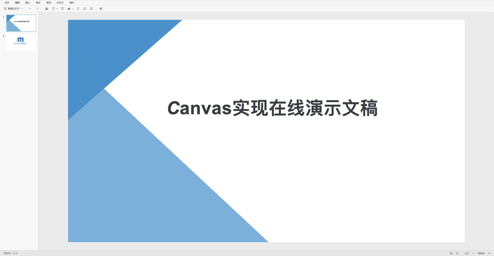

<p align="center">
    
</p>

<p align="center">
    <a href="https://github.com/moneyinto/canvas-ppt/stargazers" target="_black">
        
    </a>
    <a href="https://www.github.com/moneyinto/canvas-ppt/network/members" target="_black">
        
    </a>
    <a href="https://www.typescriptlang.org" target="_black">
        
    </a>
    <a href="https://github.com/moneyinto/canvas-ppt/issues" target="_black">
        
    </a>
</p>

# CANVAS-PPT
> 一个基于Vue3.x + Typescript + canvas实现的在线演示文稿。

# 项目展示


# 项目运行
```
npm install

npm run dev
```

# 功能列表
### 基础功能
- [x] 历史记录（撤销、重做）
- [x] 右键菜单

### 幻灯片页面编辑
- [x] 页面列表
- [x] 页面新增
- [x] 页面删除
- [x] 页面复制粘贴
- [x] 页面排序
- [x] 画布缩放、移动
- [x] 页面背景设置
- [x] 导出
- [x] 导入
- [ ] 快捷键

### 幻灯片元素编辑
- [x] 元素添加
- [x] 元素删除
- [x] 元素复制粘贴
- [x] 元素拖拽移动
- [x] 元素旋转
- [x] 元素缩放
- [x] 元素多选（点选）
- [ ] 元素多选（框选）
- [x] 元素全选
- [ ] 多元素组合
- [x] 多元素批量编辑
- [ ] 元素锁定
- [ ] 元素吸附对齐
- [ ] 元素锁定缩放比例
- [x] 元素层级调整
- [x] 元素对齐到画布
- [x] 元素对齐到其他元素
- [x] 粘贴外部图片

#### 文字
- [x] [研究canvas文本编辑器](https://github.com/moneyinto/canvas-editor)
- [x] 字体设置
- [x] 字体大小设置
- [x] 字体颜色设置
- [x] 字体粗体设置
- [x] 字体斜体设置
- [x] 字体下划线设置
- [x] 字体删除线设置
- [x] 文本选中
- [x] 光标移动
- [x] 文本输入
- [x] 回车换行
- [x] 文本单个删除
- [x] 删除选中文本
- [x] 复制、剪切、粘贴文本
- [x] 粘贴外来文本（不带格式）
- [ ] 粘贴外来文本（带格式）
- [x] 文本设置行高
- [x] 文本左对齐、居中、右对齐
- [x] 填充色
- [x] 透明度
- [x] 边框
- [x] 文字阴影

#### 图片
- [x] 粘贴外来图片
- [ ] 裁剪
- [x] 边框
- [x] 阴影
- [x] 填充色
- [x] 透明度

#### 形状
- [x] 填充色
- [x] 边框
- [x] 阴影
- [x] 透明度
- [x] 翻转
- [ ] 文本

#### 图表
- [x] 条形图
- [x] 柱状图
- [x] 折线图
- [x] 饼状图
- [x] 漏斗图
- [x] 编辑图表
- [x] 图例显示及位置
- [x] 图表标题
- [x] 填充色
- [x] 透明度
- [x] 柱状图堆叠显示
- [x] 边框

#### 表格

#### 视频
- [x] [研究canvas播放视频](https://github.com/moneyinto/canvas-video)
- [x] 插入视频
- [x] 视频渲染
- [x] 视频播放暂停
- [x] 视频进度点击调整
- [x] 简单的视频全屏播放（直接使用video自带的全屏）

#### 音频
- [x] 插入音频

#### 公式
- [x] [研究公式](https://github.com/moneyinto/vue-mathJax)
- [x] 插入公式
- [x] 编辑公式
- [x] 填充色
- [x] 透明度
- [x] 边框

### 幻灯片放映

### 思考待解决问题
- 图片拉伸和适配两种模式
- ~~不规则形状如何判断点在形状内（目前选中元素都是以矩形区域判断，当两个形状重叠时，看到是选的A元素，确展示的是选中的B元素）~~
- 形状后面要考虑增加点位控制可调整的功能
- ~~翻转后且存在旋转，鼠标拖拽的距离和实际变化的宽高存在误差，待解决~~ （翻转目前改成控制框不随着翻转）
- 渲染canvas和控制canvas，原先设想降低渲染操作对性能的损耗，渲染canvas只做渲染工作，操作元素全在控制canvas，但是控制层在渲染层之上，导致被选中操作的元素会在最高层，遮挡其他元素，但是根据层级选中的元素可能是最底层级的，目前优化方案改为，操作绘线，绘制新增元素效果依旧在控制层，其余元素变动转移到渲染层，但是频繁的渲染，加上渲染层元素很多时，会成倍增加性能的消耗
- 导出采用`pptxgenjs`第三方库，但是有许多方面不支持，后面考虑借鉴补充实现完善一下(`pptxgenjs`bug导出音频不成功，还是视频)
- 导入功能插件待完善

### 功能实现规划
- 元素吸附。每个元素四个角的点及中心点一共5个点，构成5条横向线和纵向线，移动是进行横向纵向的比对判断进行吸附，并绘制对齐的虚线。
- ppt 导入
- 预览情况下实现音视频控制播放
- 实现electron版，进行文件编辑及保存

### 问题记录
- 由于目前一直在更新迭代，数据结构也在调整中，如果demo查看不了，可能是因为数据引起的，可以删除indexdb后刷新试试。

***参考`石墨文档`ppt样式，使用canvas学习实现ppt功能***
