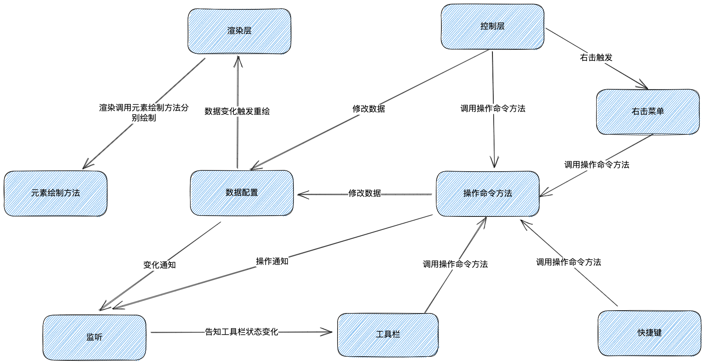

<p align="center">
    
</p>

<p align="center">
    <a href="https://github.com/moneyinto/canvas-ppt/stargazers" target="_black">
        
    </a>
    <a href="https://www.github.com/moneyinto/canvas-ppt/network/members" target="_black">
        
    </a>
    <a href="https://www.typescriptlang.org" target="_black">
        
    </a>
    <a href="https://github.com/moneyinto/canvas-ppt/issues" target="_black">
        
    </a>
</p>

# CANVAS-PPT
> 一个基于Vue3.x + Typescript + canvas实现的在线演示文稿。

##### 在线体验地址：[https://demo.money-into.com/canvas-ppt](https://demo.money-into.com/canvas-ppt)

# 项目展示


# 项目运行
```
npm install

npm run dev
```

# 思路图


# 功能列表
### 基础功能
- [x] 历史记录（撤销、重做）
- [x] 右键菜单

### 幻灯片页面编辑
- [x] 页面列表
- [x] 页面新增
- [ ] 页面模版
- [x] 页面删除
- [x] 页面复制粘贴
- [x] 页面排序
- [x] 画布缩放、移动
- [x] 页面背景设置
- [x] 导出
- [x] 导入
- [x] [快捷键](./doc/HOT_KEY.md)

### 幻灯片元素编辑
- [x] 元素添加
- [x] 元素删除
- [x] 元素复制粘贴
- [x] 元素拖拽移动
- [x] 元素旋转
- [x] 元素缩放
- [x] 元素多选（点选）
- [ ] 元素多选（框选）
- [x] 元素全选
- [ ] 多元素组合
- [x] 多元素批量编辑
- [ ] 元素锁定
- [ ] 元素吸附对齐
- [ ] 元素锁定缩放比例
- [x] 元素层级调整
- [x] 元素对齐到画布
- [x] 元素对齐到其他元素
- [x] 粘贴外部图片
- [x] 元素动画

#### 文字
- [x] [研究canvas文本编辑器](https://github.com/moneyinto/canvas-editor)
- [ ] 纵向文本
- [x] 字体设置
- [x] 字体大小设置
- [x] 字体颜色设置
- [x] 字体粗体设置
- [x] 字体斜体设置
- [x] 字体下划线设置
- [x] 字体删除线设置
- [x] 文本选中
- [x] 光标移动
- [x] 文本输入
- [x] 回车换行
- [x] 文本单个删除
- [x] 删除选中文本
- [x] 复制、剪切、粘贴文本
- [x] 粘贴外来文本（不带格式）
- [ ] 粘贴外来文本（带格式）
- [x] 文本设置行高
- [x] 文本左对齐、居中、右对齐
- [x] 填充色
- [x] 透明度
- [x] 边框
- [x] 文字阴影

#### 图片
- [x] 粘贴外来图片
- [ ] 裁剪
- [x] 边框
- [x] 阴影
- [x] 填充色
- [x] 透明度

#### 形状
- [x] 填充色
- [x] 边框
- [x] 阴影
- [x] 透明度
- [x] 翻转
- [x] 文本

#### 图表
- [x] 条形图
- [x] 柱状图
- [x] 折线图
- [x] 饼状图
- [x] 漏斗图
- [x] 编辑图表
- [x] 图例显示及位置
- [x] 图表标题
- [x] 填充色
- [x] 透明度
- [x] 柱状图堆叠显示
- [x] 边框

#### 表格
- [x] 插入表格
- [x] 边框
- [x] 阴影
- [x] 填充色
- [x] 单元格填充色
- [x] 文本
- [x] 表格宽高调整
- [x] 合并和拆分单元格
- [x] 主题色设置
- [x] 插入行
- [x] 插入列
- [x] 删除行
- [x] 删除列

#### 视频
- [x] [研究canvas播放视频](https://github.com/moneyinto/canvas-video)
- [x] 插入视频
- [x] 视频渲染
- [x] 视频播放暂停
- [x] 视频进度点击调整
- [x] 简单的视频全屏播放（直接使用video自带的全屏）

#### 音频
- [x] 插入音频

#### 公式
- [x] [研究公式](https://github.com/moneyinto/vue-mathJax)
- [x] 插入公式
- [x] 编辑公式
- [x] 填充色
- [x] 透明度
- [x] 边框

### 幻灯片放映
- [x] [研究canvas实现元素动画](https://github.com/moneyinto/canvas-animation)
- [x] 预览放映
- [x] 预览元素动画
- [x] 画笔功能
- [x] 页面切换动画

### [electron版本](https://github.com/moneyinto/canvas-ppt/tree/electron)
- [x] 网页唤醒或下载客户端
- [x] 对应文件格式打开
- [x] 编辑保存
- [x] 另存为

### react-native版本(开发中)

- #### 运行
```
npm install

npm run dev
```
- #### 打包
```
npm run electron:build
```

### [思考待解决问题](./doc/QUESTION.md)

### [功能实现规划](./doc/FUNCTION_REALIZATION/MAIN.md)

<br />

### 注意
- electron使用node 16 往上版本
- 由于目前一直在更新迭代，数据结构也在调整中，如果demo查看不了，可能是因为数据引起的，可以删除indexdb后刷新试试。

***参考`石墨文档`样式，使用canvas学习实现ppt功能***
